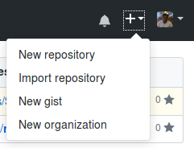

## La práctica hace al Maestro...  :mortar_board:

1. Crea un listado de todo los pasos que toma hacer un flujo completo de GIT, este listado deberá ser mas un tutorial que un listado. Acompáñalo con imágenes, y recuerda que MarkDown tiene una manera para que se pueda escribir código en el.

  * Para empezar un proyecto en GIT con almacenamiento en GitHub, debemos en entrar a [GitHub](https://github.com/), una vez iniciado sesión, en la parte superior derecha, nos aparecerá a lado de nuestra foto de perfil un icono de :heavy_plus_sign:, al cuál al darle click desplegará un menú, donde debemos seleccionar la primera opción "New repository".

    

  * 
