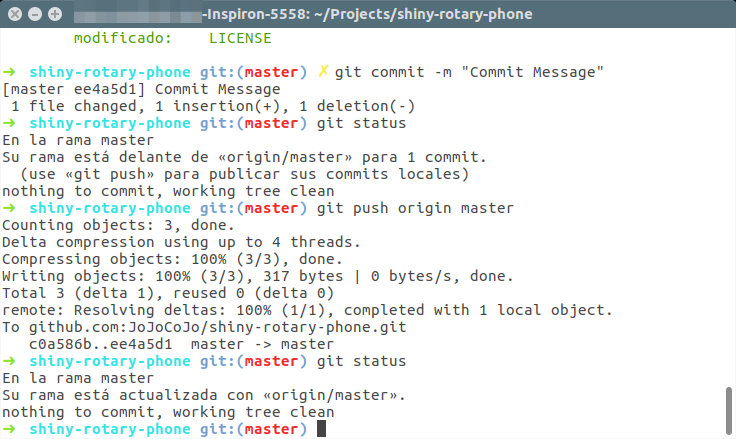

## La práctica hace al Maestro...  :mortar_board:


Crea un listado de todo los pasos que toma hacer un flujo completo de GIT, este listado deberá ser mas un tutorial que un listado. Acompáñalo con imágenes, y recuerda que MarkDown tiene una manera para que se pueda escribir código en el.

* REQUISITOS:
  1. Zsh para la terminal.
  2. Git
  3. Cuenta en GitHub

### Empezando el proyecto

  * Para empezar un proyecto en GIT con almacenamiento en GitHub, debemos en entrar a [GitHub](https://github.com/), una vez iniciado sesión, en la parte superior derecha, nos aparecerá a lado de nuestra foto de perfil un icono de :heavy_plus_sign:, al cuál al darle click desplegará un menú, donde debemos seleccionar la primera opción "New repository".

    <p align="center">
      
    </p>

  * Se motrará la siguiente pantalla, en la cuál una vez llenado los datos, podremos proceder a usar la terminal

    <p align="center">
      
    </p>

  * Primero se debe de asignar un nombre y descripción al nnuevo repositorio.

    <p align="center">
      
    </p>

    * Después seleccionar el tipo de repositorio que se va a crear, los cuales pueden ser:

      <p align="center">
        
      </p>

      * Público: Da al repositorio la propiedad como su nombre lo indica que sea público y cualquier usuario con cuenta de GitHub pueda acceder / clonar / descargarlo. P.D. Esta opción es gratis.

      * Privado: Brinda la capacidad de definir quienes pueden ver, aportar, descargar / clonar el repositorio para poder ayudar en el trabajo del proyecto añadiendo colaboradores que cuenten con una cuenta de GitHub. P.D. Esta opción es de paga.

  * Posteriormente se puede marcar  :ballot_box_with_check: la opción de crear un repositorio con un archivo README.md

    <p align="center">
      
    </p>

    * y seleccionar si se crea el archivo .gitignore el cual dependiendo del proyecto o el lenguaje en el que se vaya a trabajar cambia la creación por defecto del archivo.

      <p align="center">
        
      </p>

    * Por último se puede seleccionar una licencia, la más común es la "MIT License" la cual no da crédito de lo que este en el proyecto y que se debe de reconocer a él/los autores del mismo en caso de hacer uso del proyecto en cuestión o modificaciones al mismo implementándolo en algún otro proyecto.

      <p align="center">
        
      </p>

  * Por último (para terminar de crear el repositorio) se debe presionar el botón "Create repository", y tendremos el repositorio creado.

    <p align="center">
      
    </p>

  * Al terminar la acción nos mostrará la página principal de repositorio, donde:

    <p align="center">
      
    </p>

    1. Primero al dar click en el botón "Clone or download" nos desplegará un menú.

    2. Y en seguida podremos copiar directamente el link del repositorio.

### Bajando el proyecto y empezando a hacer cambios

  *  Una vez copiado / obtenido el link del repositorio, podemos clonar / descargar el proyecto en nuestras PC / laptops con la siguiente instrucción:

  ```
  git clone git@github.com:JoJoCoJo/shiny-rotary-phone.git
  ```
  * En la terminal obtendríamos el siguiente resultado:

    <p align="center">
      
    </p>

    Y ya con eso tendríamos el proyecto en nuestra PC / laptop listo para trabajar. Si ejecutamos los siguientes comando en la terminal:

    ```
    shiny-rotary-phone/
    ls
    ```

  * Podremos ver los archivos / carpetas que acabmos de descargar / clonar del repositorio que acabamos de crear en GitHub.

    <p align="center">
      
    </p>

  * Modificando el archivo de LICENSE agregando más autores, podremos proseguir con el tutorial.

    Para abrir el archivo sólo tendremos que escribir desde la terminal la siguiente intrucción:

      ```
      atom .
      ```

    Con la cuál nos abre en este caso Atom con el proyecto listo para empezar a trabajar.

    <p align="center">
      
    </p>

    <p align="center">
      
    </p>

    Seleccionamos nuestro archivo LICENSE y agregamos autores y como podremos observar, el mismo editor nos indica cuando no hemos guardado cambios y estamos haciendo modificaciones al archivo.

    <p align="center">
      
    </p>

    Es hasta que guardamos cambios, se pone normal el icono para cerrar el archivo. Y también se notará el cambio del color del nombre del archivo.

    <p align="center">
      
    </p>

  Cuando terminamos de trabajar en nuestros archivos podemos pasar a la terminal para subir nuestros archivos al repositorio de GitHub.

### Guardando cambios
  * Para empezar escribimos y ejecutamos la instrucción en la terminal:

  ```
  git status
  ```

  * La cuál nos mostrará el siguiente resultado:

  <p align="center">
    
  </p>

  Como notaremos, nos dice que archios se han tenido una modificación Y nos recomienda ejecutar instrucciones como "git add" que es la que acontinuación usaremos.

  ```
  git add LICENSE
  git status
  ```

  Podemos observar en la terminal que no pasa nada al ejecutar la primera instrucción, pero cuándo ejecutamos la segunda ya nos marca en otro color el estatus actual.

  <p align="center">
    
  </p>

  Ahora podemos proceder a hacer el "commit" de los archivos con la siguiente instrucción:

  ```
  git commit -m "Commit Message"
  ```

  Después nos mostrará este resultado en la terminal.

  <p align="center">
    
  </p>

  Volvemos a escribir la instrucción "git status" en la terminal

  <p align="center">
    
  </p>

### Subiendo cambios

  Y nos indicará qué nuestro proyecto local o rama master esta delante de "origin/master". Ahora estamos listos para subir los cambios con la siguiente instrucción:

  ```
  git push origin master
  ```

  La cuál mostrará el siguiente resultado:

  <p align="center">
    
  </p>

  Y volviendo a ejecutar la instrucción "git status" nos dirá lo siguente:

  <p align="center">
    
  </p>

  Lo cual nos indica que la rama ya esta actualizada con "origin/master" que es donde esta alojado nuestro repositorio en GitHub.

### Creando nuevas ramas

  Generalmente cuando trabajamos en un grupo se hace una rama llamada "**develop**" de ahí podemos hacer otra rama para poder trabajar sobre ella y no afectar los cambios directos sobre la rama master.

  Para hacer una rama de master y establecerle el nombre de "**develop**", debemos de poner la siguiente instrucción:

  ```
  git branch develop
  ```
  O la siguiente instrucción, no sólo nos va a crear la nueva rama, también nos va a posicionar / cambiar de la rama actual a la que le digamos.

  ```
  git checkout -b develop
  ```
  <p align="center">
    
  </p>

  Ahora procederemos a abrir de nuevo desde la terminal la carpeta del proyecto con Atom, con la siguiente instrucción:

  ```
  atom .
  ```

  Y procederemos a modificar el README.md,
  en este caso, le agregamos un texto típico para relleno, "Lorem ipsum".

  ```
  Lorem ipsum dolor sit amet, consectetur adipisicing elit, sed do eiusmod tempor incididunt ut labore et dolore magna aliqua. Ut enim ad minim veniam, quis nostrud exercitation ullamco laboris nisi ut aliquip ex ea commodo consequat. Duis aute irure dolor in reprehenderit in voluptate velit esse cillum dolore eu fugiat nulla pariatur. Excepteur sint occaecat cupidatat non proident, sunt in culpa qui officia deserunt mollit anim id est laborum.
  ```

  Y podremos ver el mismo efecto cuando guardamos, se cambia el color del archivo y queda normal el botón de cerrar y cambia de color el nombre del archivo, registrando los cambios en el archivo.

  <p align="center">
    
  </p>

  Ahora podremos ir a la terminal y ejecutar los siguientes comandos, para empezar el "git status", después recordemos que creamos y nos ubicamos en la rama "**develop**", todos estos cambios los hemos hecho localmente, no hay nada todavía en nuestro servidor de GitHub; para subir los cambios debemos usar los siguientes comandos, cuidando que nos encontremos en la rama correcta:

  1. Primero podemos utilizar el comando:

  ```
  git branch
  ```

  Para saber en que rama estas ubicado.

  2. Después ejecutar la instrucción "git status" para poder hacer los **commits**

  ```
  git status
  git add nombre_del_archivo
  git commit -m "commit message 2"
  ```

  3. Por último sería subir al servidor de GitHub todos los cambios, junto con la rama **develop** con la instrucción:

  ```
  git push origin develop
  ```

  Dando como resultado en la terminal lo siguiente:

  <p align="center">
    
  </p>

Ahora podemos checar directo en nuestro repositorio en GitHub las ramas de nuestro proyecto y diferencias entre las mimas.

* Para empezar podremos notar en la página principal del proyecto que nos aparece un mensaje que nos indica que dice "Has subido una rama recientemente", y ya se mostrarán 2 ramas.

  <p align="center">
    
  </p>

* Al darle click al botón de "Compare & pull request" nos mostrará en su primera sección la siguiente pantalla:

  <p align="center">
    
  </p>

  Donde los óvalos muestran las ramas **master** (rama principal) y la que creamos **develop**, también nos mostrará el mensaje que le dimos al **commit** y si queremos dejar algún otro comentario, por consiguiente podemos darle click a la opción "Create pull request", pero por el momento aun no le daremos click.

* En la parte inferior hay una comparativa de los archivos con los cambios que se hicieron en la rama.

  <p align="center">
    
  </p>

* Al darle click al botón "Create pull request", completará el pull o subida de los archivos y nos inidicará si tuvo algún conflicto, en caso contrario nos mostrará la siguiente pantalla:

  <p align="center">
    
  </p>

  Ya que no nos mando ningún error, podemos proceder a hacer el merge o unión de las ramas, al hacer click en el botón "Merge pull request" nos pedirá confirmación para terminar el proceso y si queremos modificar el mensaje del **commit** este es momento indicado.

  <p align="center">
    
  </p>

  Cuando confirmamos el merge, nos saldrá la siguiente pantalla en caso de ser existosó el proceso

  <p align="center">
    
  </p>

  También tendremos la opción para poder eliminar la rama o podremos no realizar ninguna acción e irnos directamente a la pantalla principal del repositorio.

    <p align="center">
      
    </p>

  Y podremos observar los cambios hechos, ya en la rama **master**.

  * RECOMENDACIONES:
    1. Borrar las ramas que ya no uses.
    2. Antes de subir cualquier archivo o hacer algún **commit** ejecutar la instrucción "git status".
    3. Prácticar las veces que sea necesario el tutorial.
