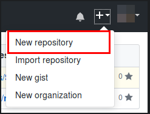

## La práctica hace al Maestro...  :mortar_board:

1. Crea un listado de todo los pasos que toma hacer un flujo completo de GIT, este listado deberá ser mas un tutorial que un listado. Acompáñalo con imágenes, y recuerda que MarkDown tiene una manera para que se pueda escribir código en el.

  * Para empezar un proyecto en GIT con almacenamiento en GitHub, debemos en entrar a [GitHub](https://github.com/), una vez iniciado sesión, en la parte superior derecha, nos aparecerá a lado de nuestra foto de perfil un icono de :heavy_plus_sign:, al cuál al darle click desplegará un menú, donde debemos seleccionar la primera opción "New repository".

    

  * Se motrará la siguiente pantalla, en la cuál una vez llenado los datos, podremos proceder a usar la terminal

    

  * Primero se debe de asignar un nombre y descripción al nnuevo repositorio.

    

    * Después seleccionar el tipo de repositorio que se va a crear, los cuales pueden ser:

      

      * Público: Da al repositorio la propiedad como su nombre lo indica que sea público y cualquier usuario con cuenta de GitHub pueda acceder / clonar / descargarlo. P.D. Esta opción es gratis.

      * Privado: Brinda la capacidad de definir quienes pueden ver, aportar, descargar / clonar el repositorio para poder ayudar en el trabajo del proyecto añadiendo colaboradores que cuenten con una cuenta de GitHub. P.D. Esta opción es de paga.

  * Posteriormente se puede marcar la opción de crear un repositorio con un archivo README.md

    

    * y seleccionar si se crea el archivo .gitignore el cual dependiendo del proyecto o el lenguaje en el que se vaya a trabajar cambia la creación por defecto del archivo.

      

    * Por último se puede seleccionar una licencia, la más común es la "MIT License" la cual no da crédito de lo que este en el proyecto y que se debe de reconocer a él/los autores del mismo en caso de hacer uso del proyecto en cuestión o modificaciones al mismo implementándolo en algún otro proyecto.

      

  * Por último se debe presionar el botón "Create repository"

    

 2. Crea un documento que explique los siguiente.

    - ¿Que es Markdown?
    - ¿Donde se utiliza?
    - ¿Cuales son las palabras claves mas utilizadas en Markdown?
